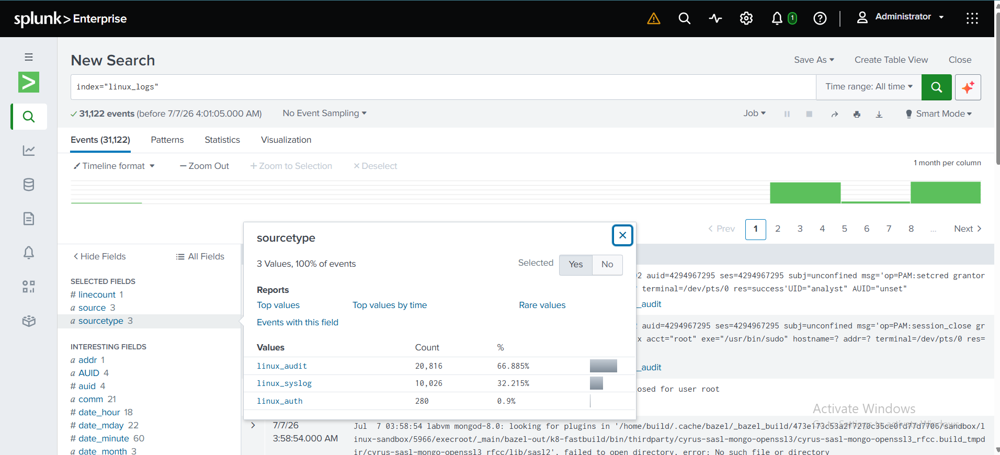
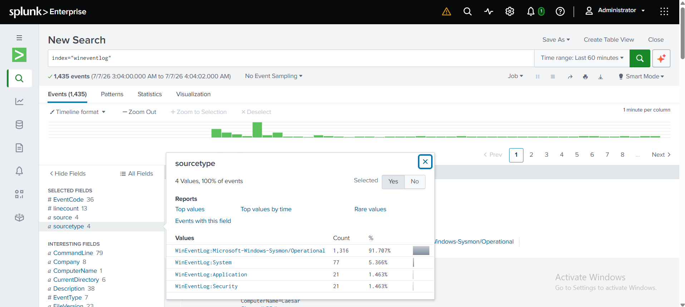
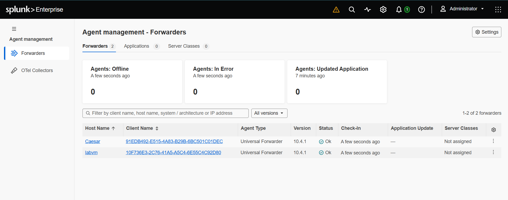
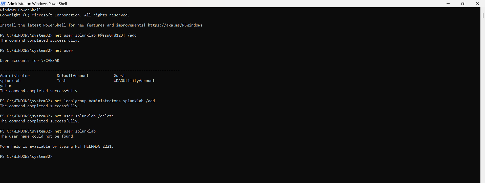
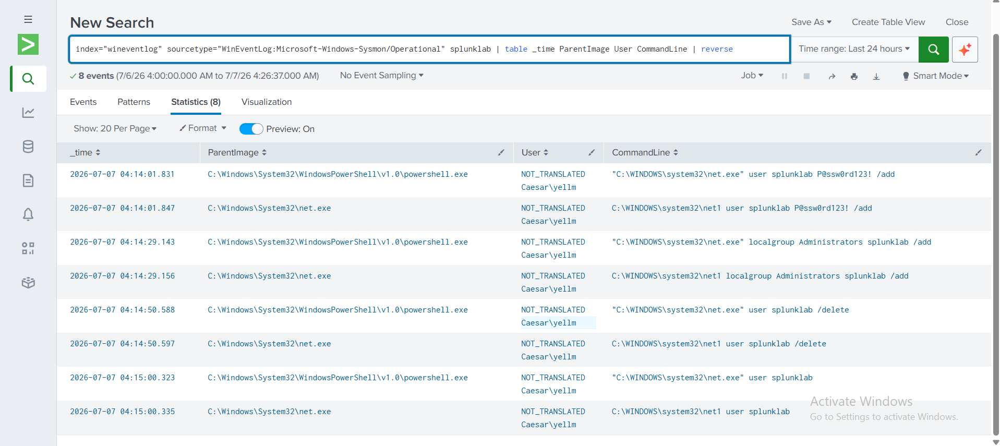
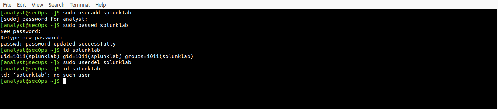
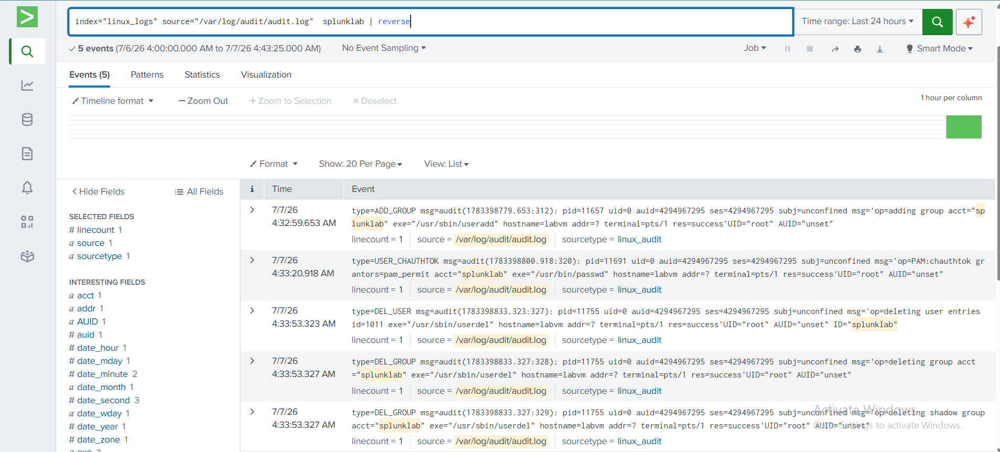

# Enterprise Splunk Monitoring Lab

## Overview

This project is a home SOC (Security Operations Center) lab built to gain hands-on experience with centralized log management, endpoint monitoring, and security event investigation using Splunk Enterprise.

The objective of this lab is to simulate a small enterprise monitoring environment where security events from both Linux and Windows systems are collected, forwarded, indexed, and analyzed through a centralized SIEM platform. Throughout this project, I focused on learning the complete log collection pipeline, understanding endpoint telemetry, and validating that security-relevant activities can be detected through Splunk searches.

The lab is continuously expanded as new monitoring capabilities and detection scenarios are implemented.

---

# Objectives

- Build a centralized log collection platform using Splunk Enterprise.
- Collect logs from both Linux and Windows endpoints.
- Configure Splunk Universal Forwarder on multiple operating systems.
- Enhance Windows endpoint visibility using Microsoft Sysmon.
- Practice writing SPL (Search Processing Language) queries.
- Validate security monitoring by generating and investigating real system events.
- Gain practical SOC Analyst and SIEM administration experience.

---

# Lab Architecture

The monitoring environment consists of a Windows host machine running VMware Workstation. A Debian Linux virtual machine hosts the Splunk Enterprise server while both the Linux VM and the Windows host forward logs to the centralized SIEM using Splunk Universal Forwarder.

> **Insert Lab Topology Diagram Here**

---

# Log Collection

## Linux Log Collection

The Debian Linux virtual machine forwards multiple system log sources to Splunk Enterprise using Splunk Universal Forwarder.

### Collected Logs

- `/var/log/syslog`
- `/var/log/auth.log`
- `auditd`

These logs provide visibility into:

- User authentication
- System activity
- Privileged operations
- Security auditing

---

## Windows Log Collection

The Windows host machine is configured with Splunk Universal Forwarder to collect native Windows Event Logs.

### Collected Logs

- Security
- System
- Application

These logs provide visibility into:

- User authentication
- Account management
- Operating system events
- Service activity
- Application events

---

# Endpoint Monitoring with Sysmon

To improve endpoint visibility, Microsoft Sysmon was installed on the Windows endpoint using the SwiftOnSecurity Sysmon configuration.

Sysmon significantly extends the default Windows Event Logs by providing detailed endpoint telemetry.

### Monitored Events

- Process Creation
- Network Connections
- DNS Queries
- Registry Modifications
- File Creation
- Process Termination

This telemetry enables more effective security monitoring and threat hunting.

---

# Connected Forwarders

Both the Debian Linux virtual machine and the Windows host are configured with Splunk Universal Forwarder.

The forwarders continuously send logs to the Splunk Enterprise server where they are indexed and available for searching.

This confirms that centralized log collection is functioning correctly.

---

# Validation Scenarios

To verify that the monitoring environment is working correctly, several security-related activities are intentionally generated and investigated within Splunk.

---

## Testing Scenario – Windows User Creation and Deletion

A local Windows user account is created on the monitored endpoint.

The previously created user account is removed.

Expected Result:

- User deletion event generated
- Event forwarded to Splunk
- Event searchable within Splunk

---

## Testing Scenario – Linux user Creation and Deletion

A user account was created and deteted on the Linux endpoint.

Expected Result:

- Event forwarded to Splunk
- Event searchable within Splunk

---

# Skills Demonstrated

Through this project, I gained practical experience with:

- Splunk Enterprise deployment
- Splunk Universal Forwarder configuration
- Centralized log management
- Linux log collection
- Windows Event Log collection
- Microsoft Sysmon deployment
- Endpoint monitoring
- Security event validation
- SPL (Search Processing Language)
- Basic security investigation
- Security monitoring workflows
- SIEM administration

---

# Conclusion

This project demonstrates the implementation of a centralized security monitoring environment using Splunk Enterprise. By integrating Linux system logs, Windows Event Logs, and Sysmon telemetry into a single SIEM platform, the lab provides practical experience in log collection, endpoint monitoring, and security event investigation.

As additional monitoring capabilities, detection logic, and attack simulations are introduced, this lab will continue to serve as a platform for developing hands-on SOC Analyst and Detection Engineering skills.
