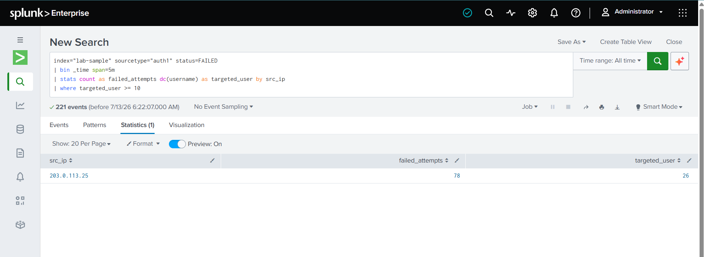

# Password Spraying Detection

## Overview

This lab simulates a **Password Spraying** attack against a VPN service. An external attacker attempts to authenticate to multiple user accounts from a single source IP address using the same password. Unlike a traditional brute-force attack, password spraying targets many different accounts while limiting the number of attempts per account to avoid account lockout policies. The objective of this detection is to identify a single source IP generating a high number of failed authentication attempts against multiple unique user accounts. This detection maps to **MITRE ATT&CK T1110.003 - Password Spraying**.

---

## Log File

[📥 Sample Log File](../log-files/password_spraying.log)

---

## Detection Query

```spl
index="lab-sample" sourcetype="auth1" status=FAILED
| bin _time span=5m
| stats count as failed_attempts dc(username) as targeted_user by src_ip
| where targeted_user >= 10
```

---

## Query Explanation

- Searches only failed authentication events.
- Groups authentication events by the source IP address.
- Counts the total number of failed login attempts from each source IP.
- Counts the number of unique user accounts targeted by each source IP.
- Identifies source IP addresses that exceed the defined thresholds, indicating potential password spraying activity.

---

## Detection Result

### Search Result


