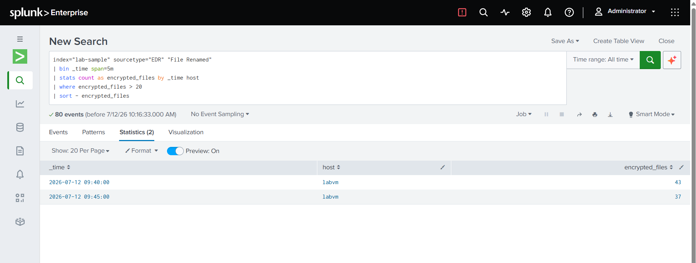

# Ransomware Activity Detection

## Overview

This lab simulates a **Ransomware** attack where a compromised endpoint rapidly encrypts files, resulting in a large number of file rename events within a short period of time. The objective of this detection is to identify hosts exhibiting abnormal file encryption activity, allowing security analysts to quickly isolate affected systems and minimize further impact. This detection aligns with **MITRE ATT&CK T1486 – Data Encrypted for Impact**.

---

## Log File

[📥 Sample Log File](../log-files/EDR.log)

---

## Detection Query

```spl
index="lab-sample" sourcetype="EDR" "File Renamed"
| bin _time span=5m
| stats count as encrypted_files by host _time
| where encrypted_files > 20
| sort - encrypted_files
```

---

## Query Explanation

This search monitors endpoint file rename events and groups them into five-minute intervals for each host. It counts the number of files renamed within each time window and identifies hosts exceeding the configured threshold. A high volume of file rename activity in a short period may indicate ransomware encryption and should be investigated immediately.

---

## Detection Result


